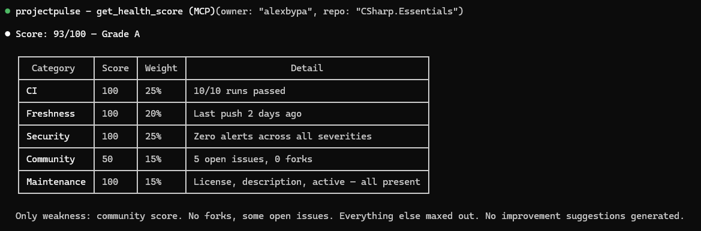

# ProjectPulse MCP

**Is that repo healthy, secure, and actively maintained? Ask your AI assistant — get a graded verdict in seconds.**

ProjectPulse is a Model Context Protocol (MCP) server that lets Claude, Cursor, VS Code Copilot, and any MCP-compatible assistant analyze the **health, security, and maintenance status of any GitHub repository** — directly inside your conversation.

[](https://www.npmjs.com/package/projectpulse-mcp)
[](https://www.npmjs.com/package/projectpulse-mcp)
[](LICENSE)
[](https://nodejs.org)

---

## Why ProjectPulse?

The official GitHub MCP server manages repos. **ProjectPulse judges them.**

- 🩺 **Graded verdicts, not raw data** — every check returns a 0–100 score, a letter grade (A–F), a per-category breakdown with weights, and a plain-language summary of the weaknesses. Judgment with receipts, never a black box.
- 📊 **DORA metrics without enterprise tooling** — deployment frequency, lead time, change failure rate, and MTTR from any repo. No Datadog, no Harness, no GitHub App setup.
- 🔒 **Security posture built in** — code scanning alerts (CodeQL) and dependency analysis are first-class tools, not an afterthought.
- ⚖️ **Side-by-side comparison** — evaluating two libraries? Compare their pulse in one call.
- 🆓 **Free, local, MIT** — runs via `npx`, your token never leaves your machine. No hosted service, no pay-per-usage.

## Quick Start

Requires Node.js ≥ 18 and a [GitHub personal access token](https://github.com/settings/tokens) (read-only scopes are enough for public repos).

### Claude Code

```bash
claude mcp add projectpulse --env GITHUB_TOKEN=ghp_your_token -- npx -y projectpulse-mcp
```

### Claude Desktop

Add to `claude_desktop_config.json`:

```json
{
  "mcpServers": {
    "projectpulse": {
      "command": "npx",
      "args": ["-y", "projectpulse-mcp"],
      "env": {
        "GITHUB_TOKEN": "ghp_your_token"
      }
    }
  }
}
```

### Cursor / VS Code

Add to `.mcp.json` (Cursor) or your MCP settings (VS Code):

```json
{
  "servers": {
    "projectpulse": {
      "command": "npx",
      "args": ["-y", "projectpulse-mcp"],
      "env": {
        "GITHUB_TOKEN": "ghp_your_token"
      }
    }
  }
}
```

That's it. Now just ask:

> *"Is `facebook/react` still actively maintained?"*
> *"Compare the health of `vite` and `webpack` before I migrate."*
> *"Show me the DORA metrics of my repo over the last 90 days."*

## Tools

| Tool | Question it answers |
|---|---|
| `get_repo_health` | What is the overall state of this repo — activity, responsiveness, community? |
| `get_health_score` | What's the grade, and exactly which categories produced it? |
| `get_dora_metrics` | How elite is this team's delivery performance (frequency, lead time, CFR, MTTR)? |
| `analyze_code_scanning` | Are there open CodeQL / code scanning security alerts? |
| `analyze_dependencies` | How outdated or risky are the dependencies? |
| `check_ci_status` | Is CI green, flaky, or silently broken? |
| `compare_repos` | Which of these repos is the safer bet, dimension by dimension? |

## See it in action

A real response to *"health score of `alexbypa/CSharp.Essentials`"*:



```
Score: 93/100 — Grade A

| Category    | Score | Weight | Detail                                 |
|-------------|-------|--------|----------------------------------------|
| CI          | 100   | 25%    | 10/10 runs passed                      |
| Freshness   | 100   | 20%    | Last push 2 days ago                   |
| Security    | 100   | 25%    | Zero alerts across all severities      |
| Community   | 50    | 15%    | 5 open issues, 0 forks                 |
| Maintenance | 100   | 15%    | License, description, active — present |

Only weakness: community score. No forks, some open issues.
Everything else maxed out.
```

Every answer includes the score, the weighted breakdown, the metric behind each category, and a narrative summary of what's dragging the grade down — so both you and the AI assistant can audit *why*.

## How the health score works

The score is a weighted composite of five categories, always the same, always disclosed:

| Category | Weight | What it measures |
|---|---|---|
| CI | 25% | Pass rate of recent workflow runs |
| Security | 25% | Open code scanning alerts across severities |
| Freshness | 20% | Recency of pushes and activity |
| Community | 15% | Open issues, forks, adoption signals |
| Maintenance | 15% | License, description, archived/active status |

Weights are fixed and deterministic: the same repo state always yields the same score and grade. Full scoring logic in [`docs/architecture.md`](docs/architecture.md) and [`src/scoring/health-score.ts`](src/scoring/health-score.ts).

## Configuration

| Variable | Required | Description |
|---|---|---|
| `GITHUB_TOKEN` | Recommended | GitHub PAT. Without it, you're limited to 60 requests/hour — fine for a quick look, tight for `compare_repos`. |

## Development

```bash
git clone https://github.com/alexbypa/github-projectpulse-mcp.git
cd github-projectpulse-mcp
npm install
npm run build
npm test        # Vitest — every tool is covered
```

See [`docs/roadmap.md`](docs/roadmap.md) for where the project is heading and [`docs/learning-path.md`](docs/learning-path.md) if you're learning to build MCP servers yourself.

## Contributing

Issues and PRs welcome. If a grade ever feels wrong, open an issue with the repo name — calibrating weights against real-world cases is how this tool gets better.

## License

[MIT](LICENSE) — use it anywhere, including commercial projects.
